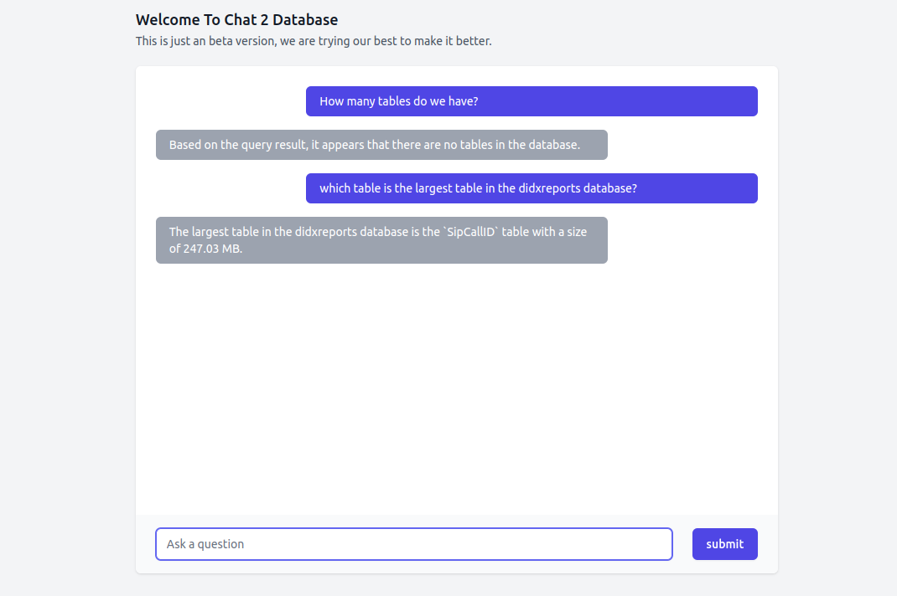
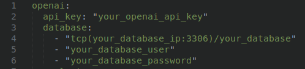

# Database Analytics Assistant
The Database Analytics Assistant is a tool with web interface designed to assist users in obtaining insights from their MySQL databases using natural language questions. By leveraging the power of OpenAI's API, users can easily ask questions about their data, and the assistant will provide answers based on the information stored in the database.



## Requirements
- Go 1.20
- A MySQL database
- An OpenAI API key

## Installation
- Clone the repository:
```bash
git clone https://github.com/erdum/golang-analytics-assistant-api.git
```

- Navigate to the project src directory:
```bash
cd golang-analytics-assistant-api/src
```

- Rename config.example.yaml to config.yaml
```bash
mv config.example.yaml config.yaml
```

- Put your OpenAI api key and your database credentials inside config.yaml file



- Build the executable:
```bash
go build -o ../app
```
This will create an executable named app in the root directory.
You can now run the app executable and it will start the application on port :80

## Deployment
If you want to run this application on production follow the above installation step than before executing the app executable make a service on the server so it will run as a normal service

- create a file called DBAnalytics.service in this directory /lib/systemd/system
```bash
 sudo vim /lib/systemd/system/DBAnalytics.service
```

- paste this text into the file
```bash
[Unit]
Description=DBAnalytics tool with web interface
[Install]
WantedBy=multi-user.target
[Service]
Type=simple
User=root
PermissionsStartOnly=true
ExecStart=absolute_path_to_app_executable
Restart=on-failure
TimeoutSec=600
```

> [!WARNING]
> put the absolute path app executable right after ExecStart=

- now you can start the service
```bash
service DBAnalytics.service start
```

## License
This project is licensed under the [MIT License](./LICENSE).
